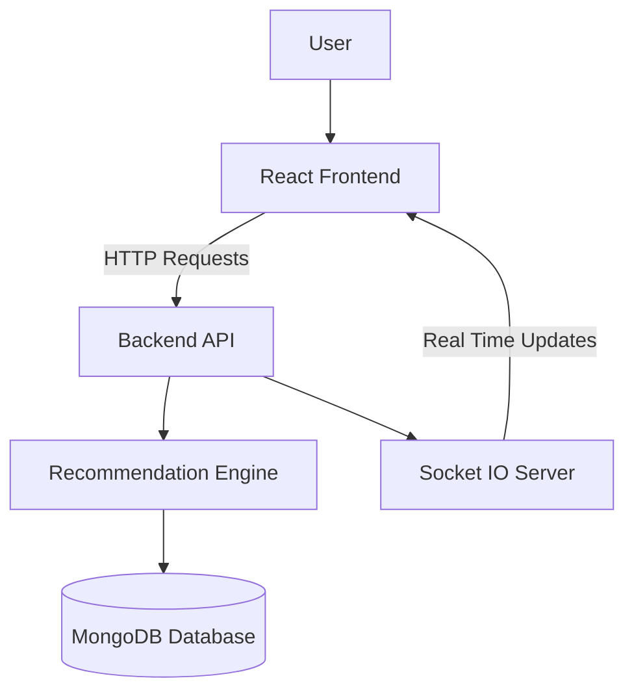
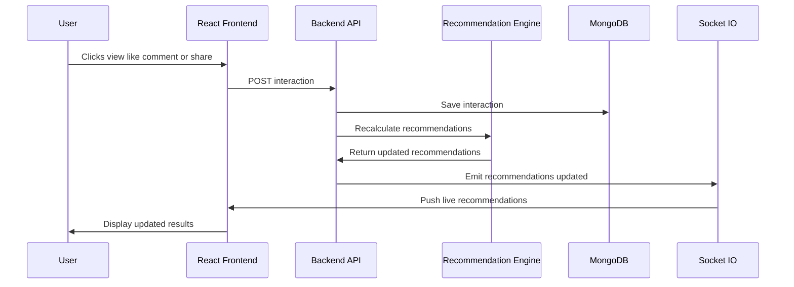

# Frontend Architecture

This document explains how the frontend demo connects to the backend Recommendation Engine API.

---

## Overview

The frontend is a React/Vite demo application built to visually test the recommendation engine.

It allows a user to:

- Select a demo user
- View available items
- Create interactions such as view, like, comment, and share
- Receive live recommendation updates through WebSocket
- View analytics and debug information

---

## Architecture Diagram



---

## Data Flow



---

## Frontend Responsibilities

The frontend handles:

- User selection
- Displaying available items
- Sending interaction events to the backend
- Listening for real-time recommendation updates
- Displaying recommendation scores
- Showing analytics and debug data

---

## Backend Responsibilities

The backend handles:

- Storing users, items, and interactions
- Running the recommendation engine
- Calculating analytics
- Sending real-time updates through Socket.io

---

## Real-Time Update Flow

When a user interacts with an item:

```text
User → Frontend → Backend API → Recommendation Engine → Database
                         ↓
                    WebSocket → Frontend
```

---

## Summary

The frontend is intentionally lightweight. Its main purpose is to demonstrate the backend recommendation engine in a visual, interactive way.